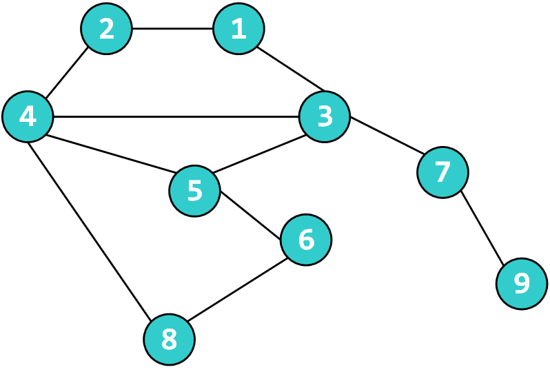
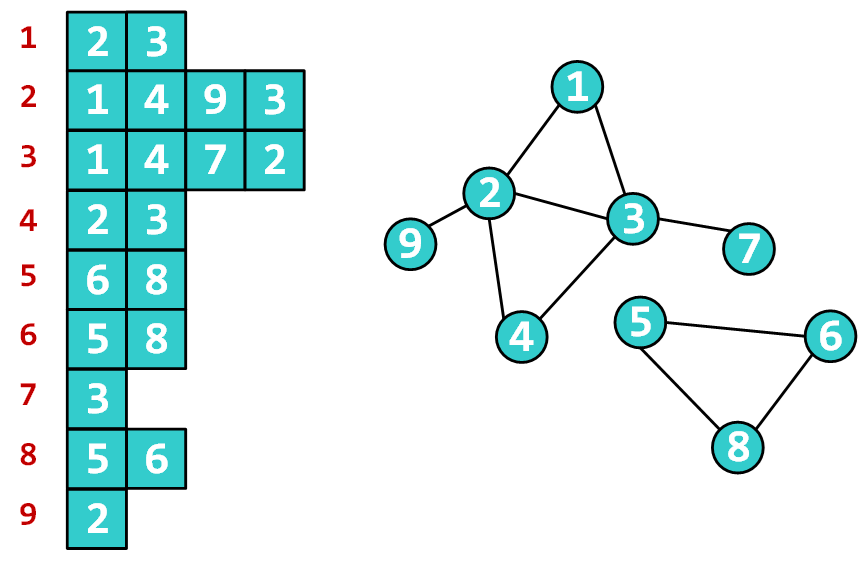

# 第6章 深度优先搜索


- **在图上寻找路径**

<div  style="width:450px; margin:0 auto;"></div>

在图上如何寻找从1到8的路径？

一种策略：只要能发现没走过的点，就走到它。有多个点可走就随便挑一个，如果无路可走就回退，再看有没有没走过的点可走。

- 运气好：[1] -> [2] -> [4] -> [8]
- 运气一般：[1] -> [2] -> [4] -> [5] -> [6] -> [8]
- 运气坏：[1] -> [3] -> [7] -> [9] => [7]  => [3] -> [5] -> [6] -> [8]（双线箭头表示回退）

<div  style="width:450px; margin:0 auto;"></div>

不连通的图，无法从节点1走到节点8。

完整的尝试过程可能为：[1] -> [2] -> [4] -> [3] -> [7] => [3] => [4] => [2] -> [9] => [2] => [1]

结论：不存在从1到8的路径。得出这个结论之前，一定会把从1出发能走到的点全部都走过。

从起点出发，走过的点要做标记，发现有没走过的点，就随意挑一个往前走，走不了就回退，此种路径搜索策略就称为“深度优先搜索”，简称“深搜”。

其实称为“远度优先搜索”更容易理解些。因为这种策略能往前走一步就往前走一步，总是试图走得更远。所谓远近(或深度），就是以距离起点的步数来衡量的。

- **判断从V出发是否能走到终点**

``` cpp
bool Dfs(V) {
    if(V为终点)
        return true;

    将V标记为旧点;
    对和V相邻的每个新节点U {
        if(Dfs(U) == true)
            return true;
    }
    return false;
}

int main(void) {
    将所有点都标记为新点;
    起点 = 1;
    终点 = 8;
    printf("%s\n", Dfs(起点) ? "Yes" : "No");
    
    return 0;
}
```

- **判断从V出发是否能走到终点，如果能输出路径**

``` cpp
Node path[MAX_LEN]; // MAX_LEN取节点总数即可
int depth;

bool Dfs(V) {
    if(V为终点) {
        path[depth] = V;
        return true;
    }

    将V标记为旧点;
    path[depth] = V;
    ++depth;
    对和V相邻的每个新节点U {
        if(Dfs(U) == true)
            return true;
    }
    --depth;
    return false;
}

int main(void) {
    将所有点都标记为新点;
    depth = 0;
    if(Dfs(起点)) {
        for(int i = 0;i <= depth; ++ i)
            printf("%d\n", path[i]);
    }
    return 0;
}
```

- **遍历图上所有节点**

``` cpp
Dfs(V) {
    将V标记为旧点;
    对和V相邻的每个新点U {
        Dfs(U);
    }
}

int main(void) {
    将所有点都标记为新点;
    while(在图中能找到新点k)
        Dfs(k);
}
```

- **图的表示方法 -- 邻接矩阵**

用一个二维数组$$G$$存放图，$$G[i][j]$$表示节点$$i$$和节点$$j$$之间边的情况（如有无边，边方向，权值大小等) 。

遍历复杂度：$$O(n^2)$$。 （$$n$$为节点数目）


- **图的表示方法 -- 邻接表**

每个节点$$V$$对应一个一维数组（vector），里面存放从$$V$$连出去的边，边的信息包括另一顶点，还可能包含边权值等。

遍历复杂度：$$O(n+e)$$。 （$$n$$为节点数目，$$e$$为边数目）

<div  style="width:450px; margin:0 auto;"></div>


## 6.1 城堡问题

**[题面]**

```
     1   2   3   4   5   6   7  
   #############################
 1 #   |   #   |   #   |   |   #
   #####---#####---#---#####---#
 2 #   #   |   #   #   #   #   #
   #---#####---#####---#####---#
 3 #   |   |   #   #   #   #   #
   #---#########---#####---#---#
 4 #   #   |   |   |   |   #   #
   #############################

   #  = Wall   
   |  = No wall
   -  = No wall
```

上图是一个城堡的地形图。请你编写一个程序，计算城堡一共有多少房间，最大的房间有多大。城堡被分割成 $$m \times n$$（$$m \leq 50$$，$$n \leq 50$$）个方块，每个方块可以有0~4面墙。

**[输入]**

程序从标准输入设备读入数据。第一行是两个整数，分别是南北向、东西向的方块数。在接下来的输入行里，每个方块用一个数字（$$0 \leq p \leq 50$$）描述。用一个数字表示方块周围的墙，1表示西墙，2表示北墙，4表示东墙，8表示南墙。每个方块用代表其周围墙的数字之和表示。城堡的内墙被计算两次，方块（1,1）的南墙同时也是方块（2,1）的北墙。输入的数据保证城堡至少有两个房间，数据保证城堡四周都是墙。

**[输出]**

城堡的房间数、城堡中最大房间所包括的方块数。结果显示在标准输出设备上。

**[样例输入]**

```
4 
7 
11 6 11 6 3 10 6 
7 9 6 13 5 15 5 
1 10 12 7 13 7 5 
13 11 10 8 10 12 13 
```

**[样例输出]**

```
5
9
```

**[思路]**

把方块看作是节点，相邻两个方块之间如果没有墙，则在方块之间连一条边，这样城堡就能转换成一个图。

求房间个数，实际上就是在求图中有多少个极大连通子图。

一个连通子图，往里头加任何一个图里的其他点，就会变得不连通，那么这个连通子图就是
极大连通子图。

对每一个房间，深度优先搜索，从而给这个房间能够到达的所有位置染色。最后统计一共用了几种颜色，以及每种颜色的数量。

如题目描述示例中，图完色可知一共有5个房间，最大的房间（1）占据9个格子。


```
#############################
# 1 | 1 # 2 | 2 # 3 | 3 | 3 #
#####---#####---#---#####---#
# 1 # 1 | 1 # 2 # 3 # 4 # 3 #
#---#####---#####---#####---#
# 1 | 1 | 1 # 5 # 3 # 5 # 3 #
#---#########---#####---#---#
# 1 # 5 | 5 | 5 | 5 | 5 # 3 #
#############################
```


**[参考代码]**

``` cpp
#include <stdio.h>

int R,C; // 行列数
int rooms[60][60];
int color[60][60] = {0};
int maxRoomArea = 0, roomNum = 0;
int totalRoomArea;

void dfs(int i, int j) {
    if(color[i][j]) return;

    ++totalRoomArea;
    color[i][j] = roomNum;
    if(!(rooms[i][j]&1)) dfs(i, j-1); // 向西
    if(!(rooms[i][j]&2)) dfs(i-1, j); // 向北
    if(!(rooms[i][j]&4)) dfs(i, j+1); // 向东
    if(!(rooms[i][j]&8)) dfs(i+1, j); // 向南
}

int main(void) {
    scanf("%d%d", &R, &C);
    for(int i=1; i<=R; ++i)
        for(int j=1; j<=C; ++j)
            scanf("%d", &rooms[i][j]);

    for(int i=1; i<=R; ++i) {
        for(int j=1; j<=C; ++j) {
            if(!color[i][j]) {
                ++roomNum ; 
                totalRoomArea = 0;
                dfs(i,j);
                maxRoomArea = totalRoomArea>maxRoomArea 
                    ? totalRoomArea : maxRoomArea;
            }
        }
    }
    printf("%d\n", roomNum);
    printf("%d\n", maxRoomArea);
}
```


## 6.2 踩方格

**[题面]**

有一个方格矩阵，矩阵边界在无穷远处。我们做如下假设：

- a. 每走一步时，只能从当前方格移动一格，走到某个相邻的方格上；
- b. 走过的格子立即塌陷无法再走第二次；
- c. 只能向北、东、西三个方向走；

请问：如果允许在方格矩阵上走 $$n$$ 步，共有多少种不同的方案。2种走法只要有一步不一样，即被认为是不同的方案。

**[输入]**

允许在方格上行走的步数 $$n$$（$$n \leq 20$$）

**[输出]**

计算出的方案数量。

**[样例输入]**

```
2
```

**[样例输出]**

```
7
```

**[思路]**

递归从(i,j) 出发，走n步的方案数，等于以下三项之和：

1. 从(i+1,j)出发，走n-1步的方案数。前提：(i+1,j)还没走过

2. 从(i,j+1)出发，走n-1步的方案数。前提：(i,j+1)还没走过

3. 从(i,j-1)出发，走n-1步的方案数。前提：(i,j-1)还没走过

**[参考代码]**

``` cpp
#include <stdio.h>

int visited[30][50] = {0};

int ways(int i, int j, int n) {
    if( n == 0)
        return 1;

    int num = 0;
    visited[i][j] = 1;
    if(!visited[i][j-1])
        num += ways(i, j-1, n-1);
    if(!visited[i][j+1])
        num += ways(i, j+1, n-1);
    if(!visited[i+1][j])
        num += ways(i+1, j, n-1);
    visited[i][j] = 0;
    return num;
}


int main(void) {
    int n;
    scanf("%d", &n);
    printf("%d\n", ways(0,25,n));
    return 0;
}
```

## 6.2 XXXX

**[题面]**


**[输入]**


**[输出]**


**[样例输入]**

```

```

**[样例输出]**

```

```

**[思路]**


**[参考代码]**

``` cpp

```


``` cpp
#include <stdio.h>
#include <vector>
#include <climits>
using namespace std;

struct Road {
    int e; // 道路终点
    int l; // 道路长度
    int t; // 道路花费
};

int K;  // 总钱数
int N;  // 城市数量
int R;  // 单向道路条数

int minLen = INT_MAX; // 最小长度
int totalLen = 0;     // 当前总长度
int totalCost = 0;    // 当前成本

// 记录城市是否走过的标识数组
int visited[110] = {0};    
// minL[i][j] 表示 从起点走到城市i时在总花费j的条件下，
// 起点到城市i目前的最优路径长度
int minL[110][10010];

// 记录道路信息的邻接表
vector<vector<Road>> adj(110);

void dfs(int s) {
    // 已经到达终点，记录最短路径长度
    if(s == N) {
        minLen = minLen<totalLen ? minLen : totalLen;
        return;
    }

    // 遍历城市s为起始地址的所有道路
    for(int i=0; i<adj[s].size(); ++i) {
        Road r = adj[s][i];
        // 目的城市已经走过
        if(visited[r.e]) continue;
        // 钱数不足到达目的城市
        if(totalCost + r.t > K) continue;
        // 到达目的城市的路径长度已经大于之前的最短路径
        if(totalLen + r.l >= minLen) continue;
        // 当前到达目的城市已经走过的路径长度大于之前到达目的城市
        // 走过的路径长度（在花费相同的情况下）
        if(totalLen + r.l >= minL[r.e][totalCost+r.t]) 
            continue;

        minL[r.e][totalCost+r.t] = totalLen + r.l;

        totalLen += r.l;
        totalCost += r.t;
        visited[r.e] = 1;
        dfs(r.e);
        totalLen -= r.l;
        totalCost -= r.t;
        visited[r.e] = 0;
    }
}

int main(void) {
    scanf("%d %d %d", &K, &N, &R);
    for(int i=0; i<R; ++i) {
        int s;
        scanf("%d", &s);
        Road r;
        scanf("%d %d %d", &r.e, &r.l, &r.t);
        if(r.e != s)
            adj[s].push_back(r);
    }
    
    for(int i=0; i<110; ++i)
        for(int j=0; j<10010; ++j)
            minL[i][j] = INT_MAX;

    visited[1] = 1;
    dfs(1);
    printf("%d\n", minLen<INT_MAX ? minLen : -1);

    return 0;
}
```


``` cpp
#include <stdio.h>
#include <math.h>
#include <limits.h>

int N, M;
int minArea = INT_MAX;
int totalArea;

// minSArr[i] : 第i层到第1层最小可能的侧面积和
int minSArr[25];
// minVArr[i] : 第i层到第1层最小可能的体积和
int minVArr[25];

void dfs(int v, int m, int r, int h) {
    if(m==0) {
        if(!v) 
            minArea = minArea<totalArea ? minArea : totalArea;
        return;
    }

    // [剪枝]所需填充体积小于0 
    if(v<=0) return;
    // [剪枝]当前表面积大于等于之前的最小表面积 
    if(totalArea>=minArea) return;
    // [剪枝]根据当前表面积搭完后表面积不会小于等于最小表面积 
    if(totalArea+minSArr[m] >= minArea) return;
    // [剪枝]根据当前体积搭完后总体积一定大于给定体积 
    if(minVArr[m] > v) return;
    // [剪枝]根据当前体积搭完后总体积一定小于给定体积 
    int sum=0;
    for(int i=r,j=h, k=m; k>0&&i>0&&j>0; --i,--j,--k)
        sum += i*i*j;
    if(sum < v) return;

    for(int rr=r; rr>=m; --rr) {
        if(m==M)
            totalArea = rr * rr;
        for(int hh=h; hh>=m; --hh) {
            totalArea += 2*rr*hh;
            dfs(v-rr*rr*hh, m-1, rr-1, hh-1);
            totalArea -= 2*rr*hh;
        }
    }
}

int main(void) {
    for(int i=1; i<25; ++i) {
        minSArr[i] = minSArr[i-1] + 2*i*i;
        minVArr[i] = minVArr[i-1] + i*i*i;
    }

    scanf("%d %d", &N, &M);

    int maxR = (int)sqrt((1.0*N-minVArr[M-1])/M);
    int maxH = (N-minVArr[M-1])/(M*M);

    dfs(N, M, maxR, maxH);

    if(minArea != INT_MAX)
        printf("%d\n", minArea);
    else
        printf("0\n");

    return 0;
}
```